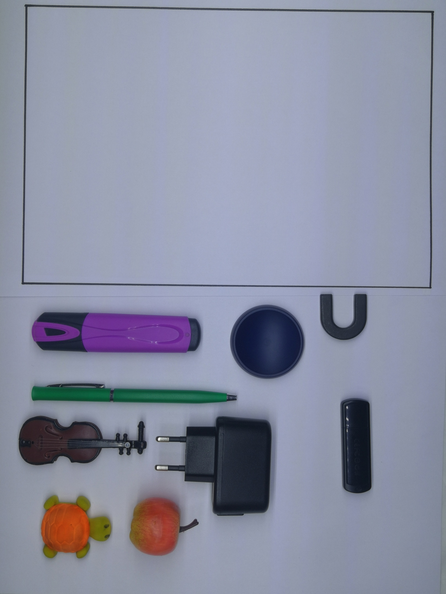
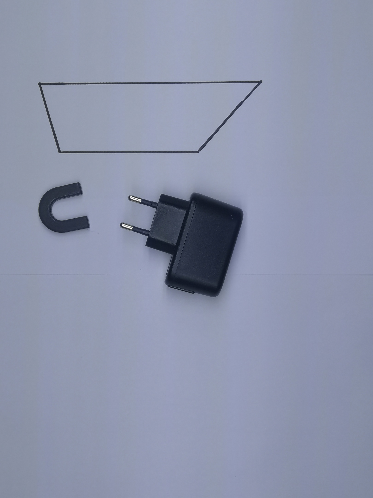
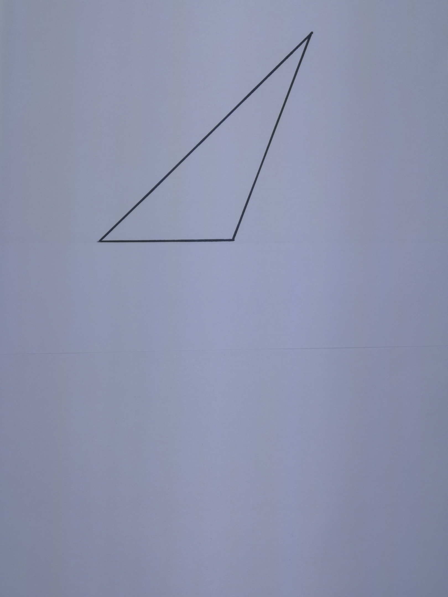
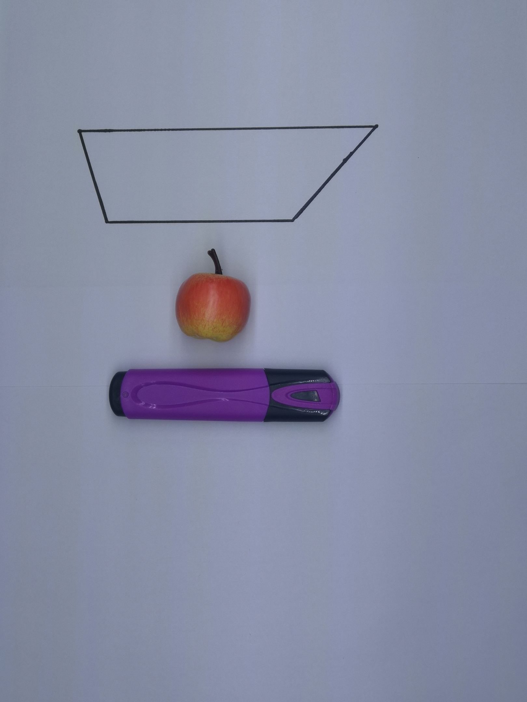
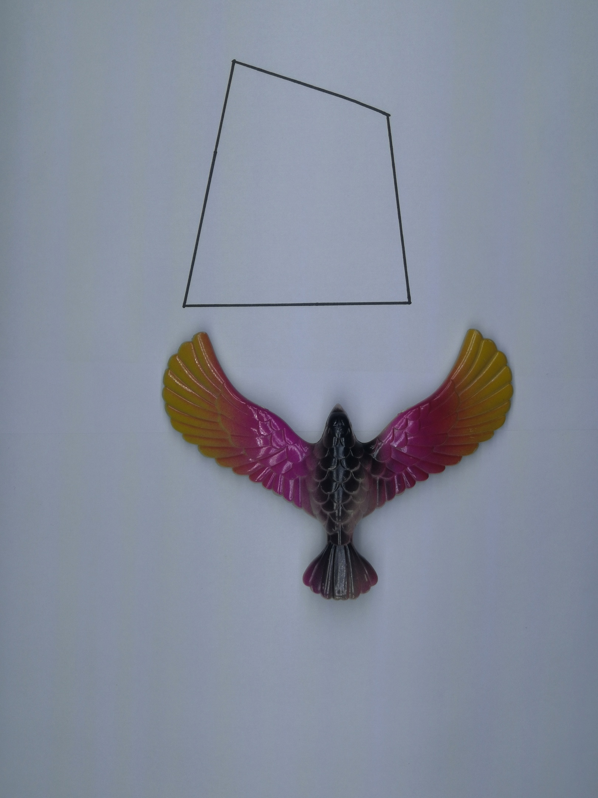
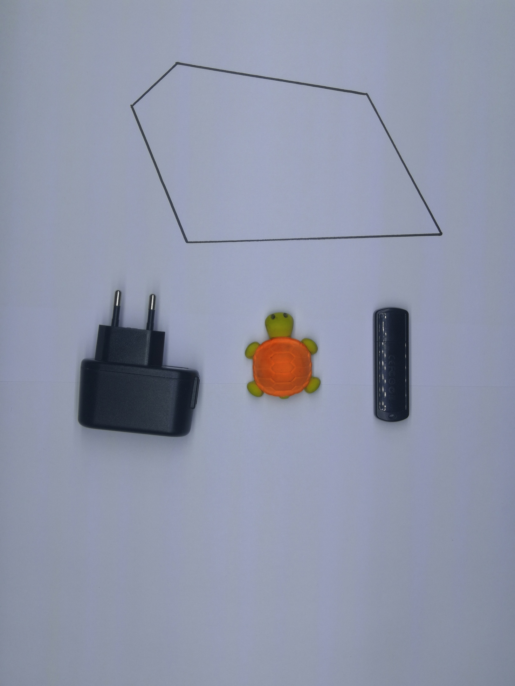

## Репрезентативные тесты
1) Все объекты помещаются в большой многоугольник True

2) Один объект легко помещается в большой многоугольник True 

3) Два объекта с трудом влезают в многоугольник True

4) Один объект не вмещается в многоугольник False

5) Один из объектов не влезает, второй легко помещается False

6) Отсутствуют объекты False

7) один объект еле влезает True

8) Оба объекта помещаются, но вместе - нет False

9) Нет многоугольника False

10) Ни один из объектов не вмещается

11) Многоугольник не выпуклый False

## Остальные тесты
12) True

13) False

14) False

15) True

16) False

17) True

18) False

19) False

20) True

